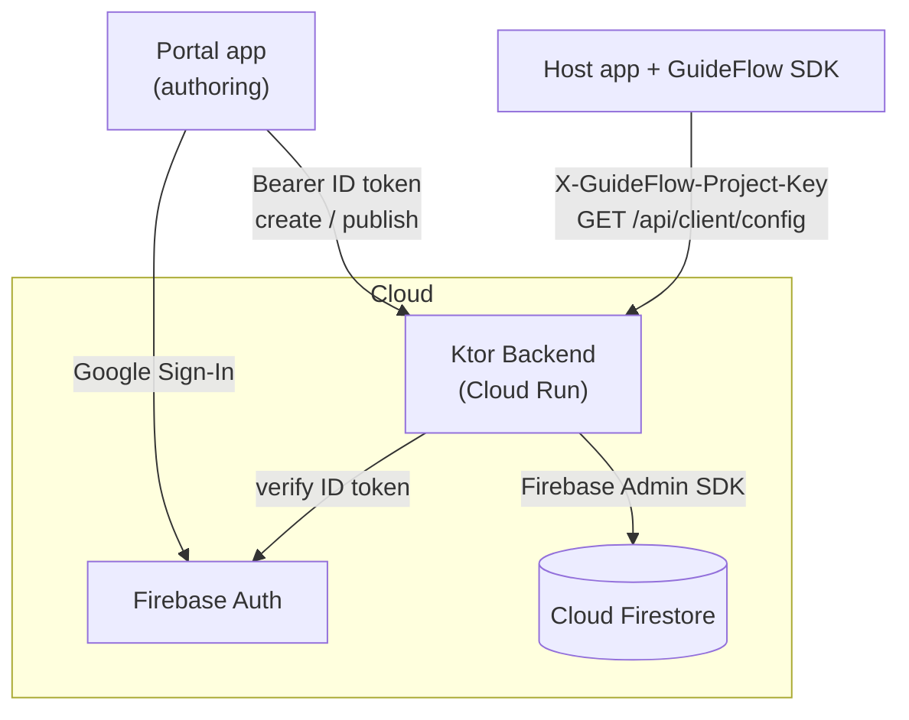
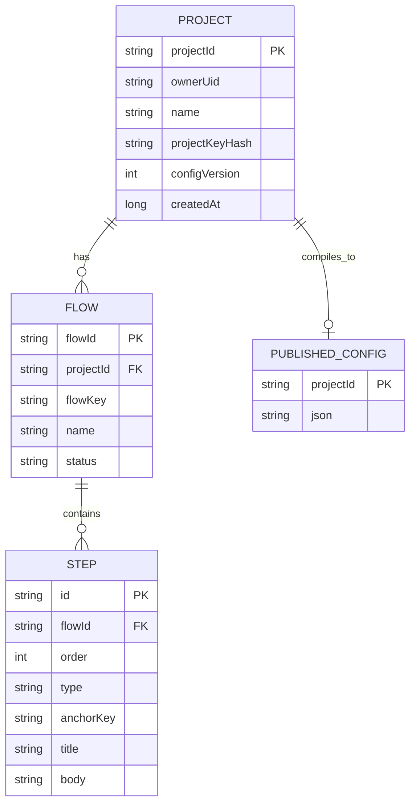

# GuideFlow SDK

A Kotlin / Jetpack Compose Android SDK for **interactive in‑app tutorials** — tooltips, spotlights, and modals — driven by tutorials authored in a companion portal, published through a Ktor backend, and stored in Cloud Firestore.

> Author a tutorial once in the portal → publish → every app that embeds the SDK downloads it and renders the guided tour. No app release required to change a tutorial.

---

## Description

GuideFlow is a complete, locally‑runnable ecosystem made of five modules:

| Module | What it is | Tech |
|---|---|---|
| `guideflow-sdk` | The reusable **Android library** that renders tutorials | Kotlin, Jetpack Compose, Ktor Client, DataStore |
| `app` | A **demo host app** that embeds the SDK | Jetpack Compose |
| `portal` | The **authoring app** (sign in, build & publish tutorials) | Jetpack Compose, Firebase Auth (Google) |
| `backend` | REST API that stores tutorials & serves config | Ktor Server, Firebase Admin, Firestore |
| `shared` | Serializable DTOs shared by all of the above | Kotlin/JVM, kotlinx.serialization |

The backend is deployed on **Google Cloud Run** and works from any network:
`https://guideflow-backend-794711970205.me-west1.run.app`

---

## Features

- **Three overlay types** — Tooltip (bubble on an element), Spotlight (dim + cut‑out), Modal (centered dialog).
- **Multi‑step flows** with Next / Back / Skip / Done navigation.
- **Anchor system** — tag any composable with `Modifier.guideFlowAnchor("key")`; steps point at it by key.
- **Graceful fallback** — a missing anchor automatically degrades to a modal and emits `ANCHOR_MISSING` (the SDK never crashes the host app).
- **Remote config** — one `GET /api/client/config` call returns the whole published tutorial set; `currentVersion` enables `304 Not Modified`.
- **Offline cache** — last‑known‑good config persisted in DataStore; a failed refresh keeps the previous config.
- **Authoring portal** — Google Sign‑In, project / flow / step CRUD, publish with validation, live step preview.
- **Secure by design** — Firebase ID‑token verification, project ownership checks, hashed project keys, hashed SDK user IDs.

---

## Screenshots

Portal screens (drop PNGs into `docs/screenshots/` to render):

| Login | Projects | Flows | Steps | Step editor |
|---|---|---|---|---|
|  |  |  |  |  |

SDK overlays in the demo app:

| Tooltip | Spotlight | Modal |
|---|---|---|
|  |  |  |

---

## Published config (JSON)

`GET /api/client/config` (header `X-GuideFlow-Project-Key: gf_…`) returns one document:

```json
{
  "projectId": "project_22c44463",
  "configVersion": 4,
  "flows": [
    {
      "id": "flow_918e6c29",
      "flowKey": "budget_tutorial",
      "name": "Budget onboarding",
      "status": "PUBLISHED",
      "steps": [
        {
          "id": "step_6bac3c5e",
          "order": 1,
          "type": "SPOTLIGHT",
          "anchorKey": "budget_button",
          "title": "Budget Planner",
          "body": "Tap here to manage your monthly budget."
        },
        {
          "id": "step_7c0a1f22",
          "order": 2,
          "type": "MODAL",
          "anchorKey": null,
          "title": "You're all set 🎉",
          "body": "That's the tour. You can re-run it any time."
        }
      ]
    }
  ]
}
```

`StepType ∈ {TOOLTIP, SPOTLIGHT, MODAL}` · `FlowStatus ∈ {DRAFT, PUBLISHED, ARCHIVED}`.

---

## Database (Cloud Firestore)

Flat top‑level collections (chosen so flows/steps resolve by global id with single‑field queries):

```text
projects/{projectId}
  { projectId, ownerUid, name, projectKeyHash, configVersion, createdAt }

flows/{flowId}
  { flowId, projectId, flowKey, name, status }

steps/{stepId}
  { id, flowId, order, type, anchorKey, title, body }

publishedConfigs/{projectId}
  { json }   // the compiled TutorialConfig above, as a JSON string
```

Project keys are never stored raw — only `projectKeyHash` (SHA‑256). The raw `gf_…` key is shown once at creation.

---

## Public functions (SDK API)

```kotlin
object GuideFlow {
    const val SDK_VERSION: String

    fun initialize(context: Context, projectKey: String, config: GuideFlowConfig)
    fun setUser(userId: String?)                 // hashed (SHA-256) before use
    fun setListener(listener: GuideFlowListener?)
    suspend fun refreshConfig(): Result<Unit>    // fetch latest published config
    fun startFlow(flowKey: String): Result<Unit>
    fun stopFlow(reason: StopReason = StopReason.MANUAL)
    fun loadLocalFlows(flows: List<TutorialFlow>) // offline / test fallback
}

@Composable fun GuideFlowHost(modifier: Modifier = Modifier, content: @Composable () -> Unit)
fun Modifier.guideFlowAnchor(key: String): Modifier
```

Supporting types:

```kotlin
data class GuideFlowConfig(
    val baseUrl: String,
    val enableAnalytics: Boolean = true,
    val enableOfflineCache: Boolean = true,
    val debugLogging: Boolean = false,
)

interface GuideFlowListener {
    fun onFlowStarted(flowKey: String) {}
    fun onStepChanged(flowKey: String, stepIndex: Int) {}
    fun onFlowCompleted(flowKey: String) {}
    fun onFlowSkipped(flowKey: String) {}
    fun onAnchorMissing(flowKey: String, anchorKey: String) {}
    fun onError(error: GuideFlowError) {}
}

sealed class GuideFlowError {        // never thrown at the host app
    NotInitialized; FlowNotFound(flowKey); AnchorMissing(anchorKey)
    NetworkError(message); InvalidConfig(message)
}
enum class StopReason { MANUAL, COMPLETED, SKIPPED }
```

---

## Inner functions & backend endpoints

### SDK internals (package `com.guideflow.sdk`)

| Component | Responsibility |
|---|---|
| `anchor/AnchorManager` | Snapshot‑state map of `key → bounds`; resolves the anchor for the current step |
| `flow/FlowCoordinator` | Owns the active flow as a `StateFlow`; Next/Back/Skip/Complete; prevents concurrent flows |
| `flow/FlowValidator` | Pre‑flight checks (≥1 step, tooltip/spotlight need an anchor) |
| `compose/GuideFlowHost` | Draws host content + the active overlay |
| `compose/TooltipOverlay · SpotlightOverlay · ModalFallback` | The three renderers + shared controls |
| `config/ConfigClient` | Ktor client → `/api/client/config`; never throws |
| `config/ConfigRepository` | Source of truth; keeps previous config on failure |
| `config/ConfigStorage` | DataStore cache (config JSON, version, user‑id hash) |

### Backend internals (package `com.guideflow.backend`)

| Component | Responsibility |
|---|---|
| `GuideFlowStore` | Storage interface — `FirestoreStore` (prod) / `InMemoryStore` (dev & tests) |
| `ProjectKeys` | Generates `gf_<hex>` keys; stores only the SHA‑256 hash |
| `FlowValidator` | Publish‑time validation (≥1 step, unique order, tooltip/spotlight anchor) |
| `ConfigCompiler` | Builds the single published `TutorialConfig` from published flows |
| `auth/AuthProvider` | `FirebaseAuthProvider` (verifies ID token) / `DevAuthProvider` (local) |

### REST endpoints

Portal endpoints require `Authorization: Bearer <Firebase ID token>` and enforce project ownership. The SDK endpoint uses the project‑key header instead.

| Method | Path | Auth | Purpose |
|---|---|---|---|
| POST | `/api/projects` | Bearer | Create project → returns project + raw key (once) |
| GET | `/api/projects` | Bearer | List the caller's projects |
| GET | `/api/projects/{projectId}` | Bearer | Get one project |
| POST | `/api/projects/{projectId}/flows` | Bearer | Create a flow |
| GET | `/api/projects/{projectId}/flows` | Bearer | List flows |
| GET | `/api/flows/{flowId}` | Bearer | Get a flow (with steps) |
| PUT | `/api/flows/{flowId}` | Bearer | Rename / re‑key a flow |
| DELETE | `/api/flows/{flowId}` | Bearer | Delete a flow |
| POST | `/api/flows/{flowId}/publish` | Bearer | Validate + publish → bumps config version |
| POST | `/api/flows/{flowId}/steps` | Bearer | Add a step |
| PUT | `/api/flows/{flowId}/steps/order` | Bearer | Reorder steps |
| PUT | `/api/steps/{stepId}` | Bearer | Update a step |
| DELETE | `/api/steps/{stepId}` | Bearer | Delete a step |
| GET | `/api/client/config` | Project key | **SDK**: the single published config (`?currentVersion` → 304) |

Errors are returned as `{ "code": "...", "message": "..." }` with the matching HTTP status.

---

## Architecture diagram



## Entity‑relationship diagram (ERD)



---

## Quick start

### Use the SDK in a host app

```kotlin
GuideFlow.initialize(
    context = applicationContext,
    projectKey = "gf_your_key",          // from the portal, shown once
    config = GuideFlowConfig(baseUrl = "https://guideflow-backend-794711970205.me-west1.run.app"),
)

setContent {
    GuideFlowHost {                       // place once near the root
        Button(modifier = Modifier.guideFlowAnchor("budget_button")) { Text("Budget") }
    }
}

GuideFlow.startFlow("budget_tutorial")   // run a published tutorial
```

### Run the whole system locally

```bash
# Backend (dev mode = in-memory + no auth)
./gradlew :backend:run
# Backend (Firebase mode = Firestore + token verification)
GUIDEFLOW_FIREBASE_CREDENTIALS="/path/to/serviceAccount.json" ./gradlew :backend:run

# Apps (Android Studio): run :portal to author, run :app to see the SDK
```

### Deploy the backend (Google Cloud Run)

```bash
gcloud run deploy guideflow-backend --source . --region me-west1 --allow-unauthenticated
```
On Cloud Run the backend uses Application Default Credentials (no key file shipped). See [`docs/documentation.md`](docs/documentation.md) for details.

---

## Tech stack

Kotlin · Jetpack Compose · Ktor (client & server) · kotlinx.serialization · DataStore · Firebase Authentication (Google Sign‑In) · Firebase Admin SDK · Cloud Firestore · Google Cloud Run · Gradle Kotlin DSL.

## Tests

- SDK: `FlowCoordinator` unit tests + `OverlayUiTest` Compose UI tests + `ConfigRepository` tests.
- Backend: `BackendTest` (create→publish→config, validation, auth) + `FirestoreLiveTest` (guarded live round‑trip).

```bash
./gradlew :guideflow-sdk:testDebugUnitTest :backend:test
```

## License

Course project (educational).
