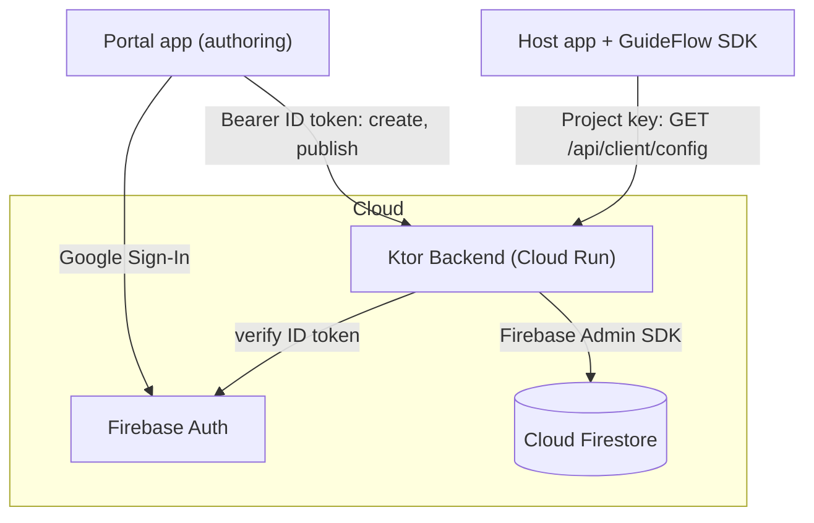
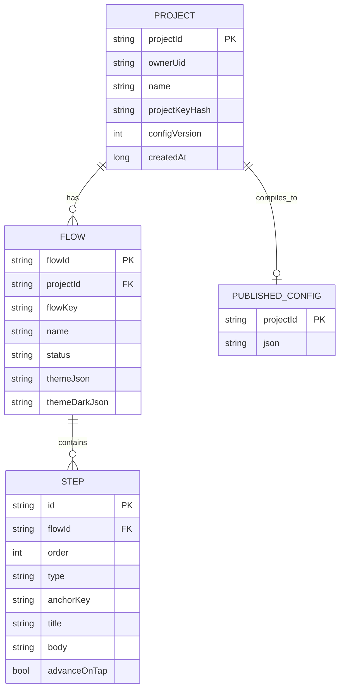

# GuideFlow SDK

A Kotlin and Jetpack Compose Android SDK for interactive in-app tutorials (tooltips, spotlights, and modals). Tutorials are authored in a companion portal, published through a Ktor backend, and stored in Cloud Firestore. Any app that embeds the SDK downloads the published configuration at runtime and renders the tour, so changing a tutorial does not require a new app release.

## Description

GuideFlow is a locally runnable ecosystem of five modules:

| Module | What it is | Tech |
|---|---|---|
| `guideflow-sdk` | The reusable Android library that renders tutorials | Kotlin, Jetpack Compose, Ktor Client, DataStore |
| `app` | A demo host app that embeds the SDK | Jetpack Compose |
| `portal` | The authoring app (sign in, build and publish tutorials) | Jetpack Compose, Firebase Auth (Google) |
| `backend` | REST API that stores tutorials and serves config | Ktor Server, Firebase Admin, Firestore |
| `shared` | Serializable DTOs shared by all of the above | Kotlin/JVM, kotlinx.serialization |

The backend is deployed on Google Cloud Run and works from any network:
`https://guideflow-backend-794711970205.me-west1.run.app`

## Features

- Three overlay types: tooltip (a bubble on an element), spotlight (dim plus cut-out), and modal (a centered dialog).
- Multi-step flows with Next, Back, Skip, and Done. Steps can span multiple screens: a flow keeps running as the host app navigates.
- An anchor system: tag any composable with `Modifier.guideFlowAnchor("key")` and steps target it by key.
- Advance-on-tap steps: the highlighted element stays interactive, so tapping it both runs the app's own action (for example navigation) and advances the tour. That step shows no Next button. While a step is active the rest of the screen is blocked, so the user cannot wander off the tour.
- The Back button can be turned off per flow, which suits flows that change screens (Back moves the tour back but cannot navigate the host app back).
- Missing-anchor fallback: a tooltip or spotlight whose anchor is not on screen falls back to a modal and emits an anchor-missing callback. The SDK does not crash the host app.
- Per-flow theming, with separate light and dark designs selected by the device theme: accent colour, button-text colour, card background, corner radius, dim opacity, right-to-left layout, custom Next/Back/Skip/Done labels, a customizable step-counter format, and title/body text size. The font follows the host app's own theme.
- One-request remote config (`GET /api/client/config`), with `304 Not Modified` based on config version.
- Offline cache in DataStore. A failed refresh keeps the previous config.
- Analytics: the SDK records flow and step events into a Room queue and uploads them with WorkManager (deleting only events the server acknowledges); the backend aggregates per-flow summaries that the portal displays as a completion rate, metric tiles, and a per-step view chart.
- Authoring portal: Google Sign-In, project and flow management (create, rename, duplicate, delete), a step editor with a live themed preview, an appearance editor for the per-flow theme, publish with validation, and a per-flow analytics view.
- Security: Firebase ID-token verification, project-ownership checks, hashed project keys, and hashed SDK user IDs.

## Screenshots

Portal screens (add PNGs to `docs/screenshots/` to render):

| Login | Projects | Flows | Steps | Step editor |
|---|---|---|---|---|
|  |  |  |  |  |

SDK overlays in the demo app:

| Tooltip | Spotlight | Modal |
|---|---|---|
|  |  |  |

## Published config (JSON)

`GET /api/client/config` with header `X-GuideFlow-Project-Key: gf_...` returns one document:

```json
{
  "projectId": "project_22c44463",
  "configVersion": 4,
  "flows": [
    {
      "id": "flow_918e6c29",
      "flowKey": "budget_tutorial",
      "name": "Budget onboarding",
      "status": "PUBLISHED",
      "steps": [
        {
          "id": "step_6bac3c5e",
          "order": 1,
          "type": "SPOTLIGHT",
          "anchorKey": "budget_button",
          "title": "Budget Planner",
          "body": "Tap here to manage your monthly budget.",
          "advanceOnTap": true
        },
        {
          "id": "step_7c0a1f22",
          "order": 2,
          "type": "MODAL",
          "anchorKey": null,
          "title": "You're all set",
          "body": "That's the tour. You can re-run it any time."
        }
      ],
      "theme": {
        "accentColor": "#4F5BD5",
        "rtl": false,
        "cornerRadius": 14,
        "titleSize": 16,
        "bodySize": 14,
        "nextLabel": "Next",
        "doneLabel": "Done",
        "progressFormat": "Step {current} of {total}"
      },
      "themeDark": { "accentColor": "#7C3AED", "rtl": false }
    }
  ]
}
```

`StepType` is one of `TOOLTIP`, `SPOTLIGHT`, `MODAL`. `FlowStatus` is one of `DRAFT`, `PUBLISHED`, `ARCHIVED`. Every `theme` field has a default, so older configs deserialize unchanged; `advanceOnTap` defaults to `false`. `themeDark` is the variant used when the device is in dark mode.

## Database (Cloud Firestore)

Flat top-level collections, chosen so flows and steps resolve by global id with single-field queries:

```text
projects/{projectId}
  { projectId, ownerUid, name, projectKeyHash, configVersion, createdAt }

flows/{flowId}
  { flowId, projectId, flowKey, name, status, themeJson, themeDarkJson }

steps/{stepId}
  { id, flowId, order, type, anchorKey, title, body, advanceOnTap }

publishedConfigs/{projectId}
  { json }   // the compiled TutorialConfig above, as a JSON string
```

Project keys are never stored raw. Only `projectKeyHash` (SHA-256) is stored; the raw `gf_...` key is shown once at creation.

## Public functions (SDK API)

```kotlin
object GuideFlow {
    const val SDK_VERSION: String

    fun initialize(context: Context, projectKey: String, config: GuideFlowConfig)
    fun setUser(userId: String?)                  // hashed (SHA-256) before use
    fun setListener(listener: GuideFlowListener?)
    suspend fun refreshConfig(): Result<Unit>     // fetch latest published config
    fun startFlow(flowKey: String): Result<Unit>
    fun stopFlow(reason: StopReason = StopReason.MANUAL)
    suspend fun flush(): Result<Int>             // upload queued analytics now
    fun loadLocalFlows(flows: List<TutorialFlow>) // local fallback, per missing key
    fun availableFlows(): List<TutorialFlow>      // published flows (+ local fallbacks)
}

@Composable fun GuideFlowHost(modifier: Modifier = Modifier, content: @Composable () -> Unit)
fun Modifier.guideFlowAnchor(key: String): Modifier
```

Supporting types:

```kotlin
data class GuideFlowConfig(
    val baseUrl: String,
    val enableAnalytics: Boolean = true,
    val enableOfflineCache: Boolean = true,
    val debugLogging: Boolean = false,
)

interface GuideFlowListener {
    fun onFlowStarted(flowKey: String) {}
    fun onStepChanged(flowKey: String, stepIndex: Int) {}
    fun onFlowCompleted(flowKey: String) {}
    fun onFlowSkipped(flowKey: String) {}
    fun onAnchorMissing(flowKey: String, anchorKey: String) {}
    fun onError(error: GuideFlowError) {}
}

sealed class GuideFlowError {        // reported to the listener, never thrown at the host app
    NotInitialized; FlowNotFound(flowKey); AnchorMissing(anchorKey)
    NetworkError(message); InvalidConfig(message)
}
enum class StopReason { MANUAL, COMPLETED, SKIPPED }
```

## Inner functions and backend endpoints

### SDK internals (package `com.guideflow.sdk`)

| Component | Responsibility |
|---|---|
| `anchor/AnchorManager` | Snapshot-state map of key to bounds; resolves the anchor for the current step |
| `flow/FlowCoordinator` | Owns the active flow as a StateFlow; Next/Back/Skip/Complete; blocks concurrent flows |
| `flow/FlowValidator` | Pre-flight checks (at least one step; tooltip and spotlight need an anchor) |
| `compose/GuideFlowHost` | Draws host content and the active overlay |
| `compose/TooltipOverlay, SpotlightOverlay, ModalFallback` | The three renderers and shared controls |
| `config/ConfigClient` | Ktor client for `/api/client/config`; never throws |
| `config/ConfigRepository` | Source of truth; keeps the previous config on failure |
| `config/ConfigStorage` | DataStore cache (config JSON, version, user-id hash) |
| `analytics/AnalyticsManager` | Builds events, queues them in Room, schedules the upload worker |
| `analytics/EventDatabase` | Room queue (`guideflow_events`), capped at 1000, oldest dropped first |
| `analytics/AnalyticsUploadWorker` | WorkManager job that uploads batches and deletes acknowledged events |

### Backend internals (package `com.guideflow.backend`)

| Component | Responsibility |
|---|---|
| `GuideFlowStore` | Storage interface: `FirestoreStore` (production) or `InMemoryStore` (dev and tests) |
| `ProjectKeys` | Generates `gf_<hex>` keys; stores only the SHA-256 hash |
| `FlowValidator` | Publish-time validation (at least one step, unique order, tooltip/spotlight anchor) |
| `ConfigCompiler` | Builds the single published TutorialConfig from published flows |
| `auth/AuthProvider` | `FirebaseAuthProvider` (verifies ID token) or `DevAuthProvider` (local) |

### REST endpoints

Portal endpoints require `Authorization: Bearer <Firebase ID token>` and enforce project ownership. The SDK endpoint uses the project-key header instead.

| Method | Path | Auth | Purpose |
|---|---|---|---|
| POST | `/api/projects` | Bearer | Create project; returns project and raw key (once) |
| GET | `/api/projects` | Bearer | List the caller's projects |
| GET | `/api/projects/{projectId}` | Bearer | Get one project |
| DELETE | `/api/projects/{projectId}` | Bearer | Delete a project and all its flows, steps, and analytics |
| POST | `/api/projects/{projectId}/flows` | Bearer | Create a flow |
| GET | `/api/projects/{projectId}/flows` | Bearer | List flows |
| GET | `/api/flows/{flowId}` | Bearer | Get a flow with steps |
| PUT | `/api/flows/{flowId}` | Bearer | Rename or re-key a flow |
| DELETE | `/api/flows/{flowId}` | Bearer | Delete a flow |
| POST | `/api/flows/{flowId}/publish` | Bearer | Validate and publish; bumps config version |
| POST | `/api/flows/{flowId}/steps` | Bearer | Add a step |
| PUT | `/api/flows/{flowId}/steps/order` | Bearer | Reorder steps |
| PUT | `/api/steps/{stepId}` | Bearer | Update a step |
| DELETE | `/api/steps/{stepId}` | Bearer | Delete a step |
| GET | `/api/client/config` | Project key | SDK config; supports `?currentVersion` for 304 |
| POST | `/api/client/events/batch` | Project key | SDK: upload a batch of analytics events |
| GET | `/api/flows/{flowId}/analytics` | Bearer | Per-flow analytics summary |

Errors are returned as `{ "code": "...", "message": "..." }` with the matching HTTP status.

## Architecture diagram



## Entity-relationship diagram



## Quick start

Use the SDK in a host app:

```kotlin
GuideFlow.initialize(
    context = applicationContext,
    projectKey = "gf_your_key",          // from the portal, shown once
    config = GuideFlowConfig(baseUrl = "https://guideflow-backend-794711970205.me-west1.run.app"),
)

setContent {
    GuideFlowHost {                       // place once near the root
        Button(modifier = Modifier.guideFlowAnchor("budget_button")) { Text("Budget") }
    }
}

GuideFlow.startFlow("budget_tutorial")    // run a published tutorial
```

Run the system locally:

```bash
# Backend in dev mode (in-memory, no auth)
./gradlew :backend:run
# Backend in Firebase mode (Firestore, token verification)
GUIDEFLOW_FIREBASE_CREDENTIALS="/path/to/serviceAccount.json" ./gradlew :backend:run

# Apps (Android Studio): run :portal to author, run :app to see the SDK
```

Deploy the backend to Google Cloud Run:

```bash
gcloud run deploy guideflow-backend --source . --region me-west1 --allow-unauthenticated
```

On Cloud Run the backend uses Application Default Credentials, so no key file is shipped. See [docs/documentation.md](docs/documentation.md) for details.

## Tech stack

Kotlin, Jetpack Compose, Ktor (client and server), kotlinx.serialization, DataStore, Firebase Authentication (Google Sign-In), Firebase Admin SDK, Cloud Firestore, Google Cloud Run, Gradle Kotlin DSL.

## Tests

- SDK: FlowCoordinator unit tests, OverlayUiTest Compose UI tests, ConfigRepository tests.
- Backend: BackendTest (create, publish, config, validation, auth) and FirestoreLiveTest (guarded live round-trip).

```bash
./gradlew :guideflow-sdk:testDebugUnitTest :backend:test
```

## License

Course project (educational).
